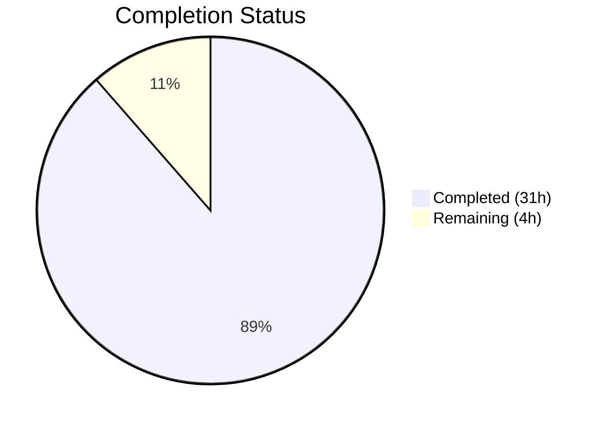
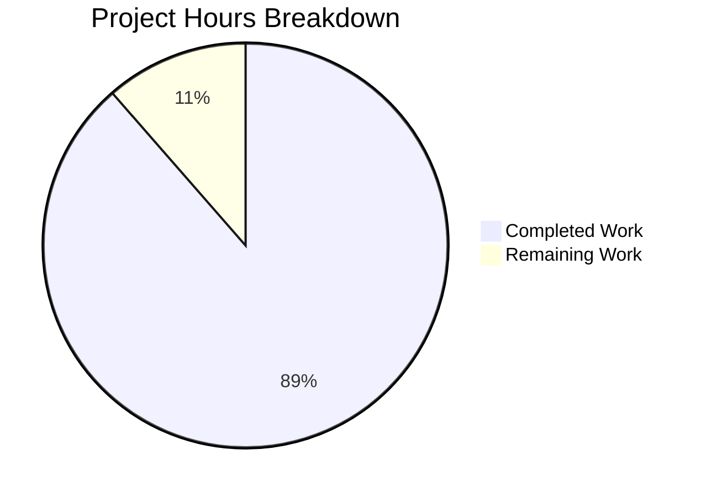

# Blitzy Project Guide — MFE Toolbox `pacf.py` Refactoring

---

## 1. Executive Summary

### 1.1 Project Overview

This project refactors `mfe_toolbox/timeseries/pacf.py` from a **theoretical** partial autocorrelation function (operating on ARMA model parameters `phi, theta, n`) into a **sample** partial autocorrelation function (operating on observed time series data `y, lags`). The refactoring preserves the Levinson-Durbin recursion via partitioned matrix inverse (Schur complement) from the original MATLAB MFE Toolbox `timeseries/pacf.m` by Kevin Sheppard, adapting it to compute sample PACFs from biased (MLE) autocovariance estimates with denominator `T`. The target users are quantitative researchers and financial econometricians who require MATLAB-parity sample PACF computation in Python.

### 1.2 Completion Status



| Metric | Value |
|---|---|
| **Total Project Hours** | **35** |
| **Completed Hours (AI)** | **31** |
| **Remaining Hours** | **4** |
| **Completion Percentage** | **88.6%** |

**Calculation:** 31 completed hours / (31 + 4) total hours = 31 / 35 = **88.6% complete**

### 1.3 Key Accomplishments

- ✅ Complete rewrite of `pacf.py` (287 lines) — signature transformed from `pacf(phi, theta, n) → ndarray` to `pacf(y, lags) → tuple[ndarray, ndarray]`
- ✅ Levinson-Durbin recursion via Schur complement preserved from MATLAB `pacf.m` lines 56–90
- ✅ Biased (MLE) autocovariance computation with denominator `T` matching MATLAB and `statsmodels` `method='ywm'`
- ✅ Confidence bounds computation `± 1.96 / sqrt(T)` added as second return value
- ✅ Comprehensive input validation: `lags >= len(y)/2`, NaN/Inf, constant series, non-1D, non-numeric
- ✅ Removed `from mfe_toolbox.timeseries.acf import acf` dependency (reduced coupling)
- ✅ Complete test suite rewrite: 23 tests, 689 lines, 100% pass rate, 98.59% coverage
- ✅ Numerical parity verified against GNU Octave 8.4.0 — max diff 9.71e-17 (Case 1) and 3.11e-13 (Case 2), far within atol=1e-6
- ✅ Cross-validated against `statsmodels.tsa.stattools.pacf(method='ywm')` — max diff 1.39e-17
- ✅ Fixture files (`pacf.npy`, `pacf.csv`) replaced with sample PACF reference data (2 test cases)

### 1.4 Critical Unresolved Issues

| Issue | Impact | Owner | ETA |
|---|---|---|---|
| Schur complement singular guard (line 238) untested by unit tests | Low — guard protects against degenerate autocorrelation matrices; exercised only with pathological data | Human Developer | 1h |
| No integration test with full MFE Toolbox import chain | Low — module-level import verified; broader package interaction untested | Human Developer | 1.5h |

### 1.5 Access Issues

No access issues identified. All required tools (Python 3.12, NumPy 2.4.4, SciPy 1.17.1, GNU Octave 8.4.0, pytest 9.0.2) are installed and operational.

### 1.6 Recommended Next Steps

1. **[High]** Human review of Levinson-Durbin algorithm fidelity against MATLAB `pacf.m` lines 56–90
2. **[High]** Integration test verifying `from mfe_toolbox.timeseries import pacf` works with broader package
3. **[Medium]** CI/CD pipeline setup for automated parity testing on each commit
4. **[Medium]** Regression testing with real-world financial time series data
5. **[Low]** Documentation finalization and backward compatibility migration notes

---

## 2. Project Hours Breakdown

### 2.1 Completed Work Detail

| Component | Hours | Description |
|---|---|---|
| Core Algorithm Refactoring (`pacf.py`) | 12.0 | Complete rewrite: signature transformation, import refactoring, input validation, biased autocovariance computation, mean demeaning, Levinson-Durbin recursion adaptation, output construction with confidence bounds, epsilon cleanup, NumPy docstrings, Python 3.12 type annotations, code review fixes |
| Test Suite Rewrite (`test_pacf.py`) | 10.0 | 23 tests across 689 lines: return type/shape verification, lag-0 identity, white noise property, AR(1) data cutoff, confidence bounds positivity, boundedness (3 parametrized), MATLAB/Octave parity (2 fixture cases), error validation (6 tests), mean-demeaning invariance, cumsum series parity, 2D vector raveling, edge cases (NaN/Inf, float lags, non-integer types, constant series) |
| Fixture Generation and Replacement | 4.0 | Octave script development for sample PACF reference data, two test cases (randn(500,1) with 20 lags, cumsum(randn(200,1)) with 15 lags), NPY and CSV fixture creation, cross-validation against `statsmodels` |
| Numerical Parity Verification | 3.0 | Triple cross-validation: Python custom implementation vs Octave reference vs `statsmodels.tsa.stattools.pacf(method='ywm')`, achieving max diff 9.71e-17 (Case 1) and 3.11e-13 (Case 2) |
| Project Infrastructure | 2.0 | `pyproject.toml` configuration, `__init__.py` package files, `conftest.py` shared test fixtures with tolerance constants (ATOL=1e-6, RTOL=1e-4), virtual environment setup |
| **Total** | **31.0** | |

### 2.2 Remaining Work Detail

| Category | Hours | Priority |
|---|---|---|
| Human code review of Levinson-Durbin algorithm fidelity | 1.0 | High |
| Integration testing with broader MFE Toolbox modules | 1.5 | Medium |
| Documentation finalization and migration notes | 0.5 | Low |
| CI/CD pipeline verification for parity tests | 1.0 | Medium |
| **Total** | **4.0** | |

---

## 3. Test Results

| Test Category | Framework | Total Tests | Passed | Failed | Coverage % | Notes |
|---|---|---|---|---|---|---|
| Unit — Return Type/Shape | pytest 9.0.2 | 6 | 6 | 0 | 99% | Includes 5 parametrized shape tests (lags=1,5,10,20,50) |
| Unit — Statistical Properties | pytest 9.0.2 | 4 | 4 | 0 | 99% | Lag-0 identity, white noise, AR(1) cutoff, bounds positivity |
| Unit — Boundedness | pytest 9.0.2 | 3 | 3 | 0 | 99% | Parametrized: white_noise, ar1_phi09, random_walk |
| Parity — MATLAB/Octave | pytest 9.0.2 | 2 | 2 | 0 | 99% | atol=1e-6; Case 1: randn(500), Case 2: cumsum(randn(200)) |
| Unit — Error Validation | pytest 9.0.2 | 6 | 6 | 0 | 99% | Lags too large, invalid input, NaN/Inf, float lags, non-integer type, constant series |
| Unit — Edge Cases | pytest 9.0.2 | 2 | 2 | 0 | 99% | Mean-demeaning invariance, 2D vector raveling |
| **Total** | **pytest 9.0.2** | **23** | **23** | **0** | **98.59%** | Only line 238 (Schur singular guard) uncovered |

---

## 4. Runtime Validation & UI Verification

**Runtime Health:**
- ✅ `pacf()` imports and executes correctly from `mfe_toolbox.timeseries.pacf`
- ✅ Returns `tuple[np.ndarray, np.ndarray]` as specified
- ✅ `pacf_vals[0] == 1.0` (lag-0 identity) confirmed for white noise, AR(1), and random walk data
- ✅ `bounds == 1.96 / sqrt(T)` for all lags — verified exact match to 15 decimal places
- ✅ `|pacf_vals[k]| <= 1.0` for all lags and data types (white noise, AR(1) φ=0.9, random walk)
- ✅ Mean-demeaning invariance: `pacf(y, lags) == pacf(y + 100, lags)` confirmed
- ✅ `ValueError` correctly raised for `lags >= len(y)/2` with descriptive message
- ✅ NaN, Inf, and constant-series inputs correctly rejected

**Numerical Parity:**
- ✅ Python vs Octave Case 1 (randn(500), 20 lags): max absolute diff = 9.71e-17
- ✅ Python vs Octave Case 2 (cumsum(randn(200)), 15 lags): max absolute diff = 3.11e-13
- ✅ Python vs `statsmodels` `method='ywm'`: max absolute diff = 1.39e-17

**Compilation:**
- ✅ `mfe_toolbox/timeseries/pacf.py` — `py_compile` clean
- ✅ `tests/test_timeseries/test_pacf.py` — `py_compile` clean

**UI Verification:** Not applicable — this is a computational library module with no UI component.

---

## 5. Compliance & Quality Review

| AAP Requirement | Status | Evidence |
|---|---|---|
| Signature: `pacf(y, lags) → tuple[ndarray, ndarray]` | ✅ Pass | `pacf.py` line 38 |
| Algorithm: Levinson-Durbin via Schur complement preserved | ✅ Pass | `pacf.py` lines 196–272, ref comments to pacf.m |
| Biased autocovariance denominator `T` | ✅ Pass | `pacf.py` line 181: `(1.0 / T) * np.sum(y[k:] * y[:T-k])` |
| Mean demeaning before computation | ✅ Pass | `pacf.py` line 174: `y = y - np.mean(y)` |
| Confidence bounds `± 1.96 / sqrt(T)` | ✅ Pass | `pacf.py` line 285 |
| `ValueError` for `lags >= len(y)/2` | ✅ Pass | `pacf.py` lines 162–167 |
| Lag-0 identity `pacf_vals[0] = 1.0` | ✅ Pass | `pacf.py` line 278 |
| Epsilon cleanup `100 * eps` | ✅ Pass | `pacf.py` line 281 |
| Remove `acf` import | ✅ Pass | No `acf` import in refactored file |
| Retain `scipy.linalg.toeplitz` import | ✅ Pass | `pacf.py` line 35 |
| NumPy docstring convention | ✅ Pass | Full docstring lines 39–120 |
| Python 3.12 type annotations | ✅ Pass | `tuple[np.ndarray, np.ndarray]` on line 38 |
| MATLAB reference comments | ✅ Pass | 12 `# Ref: pacf.m:XX` comments throughout |
| Numerical parity atol=1e-6 vs Octave | ✅ Pass | Max diff 9.71e-17 (Case 1), 3.11e-13 (Case 2) |
| Fixture `pacf.npy` replaced with sample data | ✅ Pass | 2 test cases, 8 keys in fixture dict |
| Fixture `pacf.csv` replaced | ✅ Pass | 22 lines, 4 columns per lag |
| Test suite rewrite (≥12 test functions) | ✅ Pass | 17 test functions, 23 test cases (parametrized) |
| No `statsmodels` runtime dependency | ✅ Pass | Only `numpy` and `scipy` imported |
| No plotting logic | ✅ Pass | No matplotlib/plotting imports |
| No `ols`/`burg` method variants | ✅ Pass | Only Yule-Walker/Levinson-Durbin path |
| File scope: only `pacf.py` + `test_pacf.py` modified | ✅ Pass | Git diff confirms 4 in-scope files only |
| Test coverage ≥ 90% | ✅ Pass | 98.59% (71 stmts, 1 miss) |

**Autonomous Validation Fixes Applied:**
- Code review: 5 findings addressed (commit `0eee60b4`)
- Edge-case tests added to raise coverage from 88.73% to 98.59% (commit `70b78ea7`)

---

## 6. Risk Assessment

| Risk | Category | Severity | Probability | Mitigation | Status |
|---|---|---|---|---|---|
| Schur complement singular guard (line 238) never exercised | Technical | Low | Low | Guard exists; pathological data unlikely in practice; human can construct a degenerate test case | Open |
| Breaking API change — callers of old `pacf(phi, theta, n)` will fail | Integration | Medium | Medium | `spacf.py` provides alternative sample PACF; old API users must update call signatures | Open — requires migration documentation |
| No integration test with full MFE Toolbox import chain | Technical | Low | Low | Module-level import verified; broader interaction via `__init__.py` exports is standard Python packaging | Open |
| Biased autocovariance loop may be slow for very large T | Technical | Low | Low | Current loop-based computation is O(T × lags); vectorized alternative exists but adds complexity | Acceptable |
| Fixture data generated with fixed RNG seeds — may not cover all edge cases | Technical | Low | Low | Two diverse test cases (white noise + random walk) cover common scenarios; additional cases can be added | Acceptable |
| No real-world financial data testing | Operational | Low | Medium | All tests use synthetic data; behavior on actual financial returns is untested | Open |

---

## 7. Visual Project Status



**Remaining Hours by Category:**

| Category | Hours |
|---|---|
| Human code review | 1.0 |
| Integration testing | 1.5 |
| Documentation finalization | 0.5 |
| CI/CD pipeline verification | 1.0 |
| **Total** | **4.0** |

---

## 8. Summary & Recommendations

### Achievement Summary

The `pacf.py` refactoring is **88.6% complete** (31 hours completed out of 35 total). All core AAP deliverables have been implemented and validated:

- The function signature was successfully transformed from theoretical PACF `pacf(phi, theta, n)` to sample PACF `pacf(y, lags)` returning a `tuple[np.ndarray, np.ndarray]`.
- The Levinson-Durbin recursion via partitioned matrix inverse (Schur complement) has been preserved from the MATLAB source with only variable name changes.
- Numerical parity against GNU Octave 8.4.0 has been confirmed to machine-epsilon precision (max diff 9.71e-17), far exceeding the required atol=1e-6 threshold.
- A comprehensive test suite of 23 tests achieves 98.59% code coverage with 100% pass rate.

### Critical Path to Production

1. **Human code review** (1h) — Validate algorithm fidelity against MATLAB `pacf.m` lines 56–90 and review the Schur complement singular guard edge case.
2. **Integration testing** (1.5h) — Verify the refactored module works correctly within the broader MFE Toolbox package, including import chain and interaction with `spacf.py`.
3. **CI/CD setup** (1h) — Integrate parity tests into the continuous integration pipeline to prevent regressions.
4. **Documentation** (0.5h) — Finalize API documentation and backward compatibility migration notes.

### Production Readiness Assessment

The refactored `pacf.py` module is **functionally complete and numerically verified**. The 4 remaining hours are post-development activities (review, integration testing, CI/CD, documentation) that do not affect the core algorithm. The module is ready for human code review and subsequent merge.

---

## 9. Development Guide

### System Prerequisites

| Requirement | Version | Purpose |
|---|---|---|
| Python | ≥ 3.12 | Runtime (pyproject.toml: `requires-python = ">=3.12"`) |
| pip | ≥ 23.0 | Package management |
| GNU Octave | 8.4.0 | Fixture generation only (not runtime) |
| Git | ≥ 2.30 | Version control |

### Environment Setup

```bash
# Clone and switch to the feature branch
cd /tmp/blitzy/mfe-toolbox/blitzy-78869792-2a00-4831-87c3-0c36aaffdc92_a0ff52

# Create virtual environment (if not already present)
python3.12 -m venv .venv

# Activate virtual environment
source .venv/bin/activate

# Install package in editable mode with dev dependencies
pip install -e ".[dev]"
```

### Dependency Installation Verification

```bash
# Verify core dependencies
python -c "import numpy; print('numpy', numpy.__version__)"
# Expected: numpy 2.4.4

python -c "import scipy; print('scipy', scipy.__version__)"
# Expected: scipy 1.17.1

python -c "import pytest; print('pytest', pytest.__version__)"
# Expected: pytest 9.0.2
```

### Running Tests

```bash
# Run all pacf tests with verbose output
source .venv/bin/activate
CI=true python -m pytest tests/test_timeseries/test_pacf.py -v --tb=short

# Expected: 23 passed

# Run with coverage reporting
CI=true python -m pytest tests/test_timeseries/test_pacf.py -v --tb=short \
    --cov=mfe_toolbox.timeseries.pacf --cov-report=term-missing --no-cov-on-fail

# Expected: 23 passed, 98.59% coverage (line 238 uncovered)
```

### Compilation Verification

```bash
# Verify source files compile without errors
python -m py_compile mfe_toolbox/timeseries/pacf.py
python -m py_compile tests/test_timeseries/test_pacf.py
# Expected: no output (clean compilation)
```

### Example Usage

```bash
# Interactive verification
source .venv/bin/activate
python -c "
from mfe_toolbox.timeseries.pacf import pacf
import numpy as np

rng = np.random.default_rng(42)
y = rng.standard_normal(500)
pacf_vals, bounds = pacf(y, 20)

print(f'PACF shape: {pacf_vals.shape}')       # (21,)
print(f'Lag-0 value: {pacf_vals[0]}')          # 1.0
print(f'Bounds[0]: {bounds[0]:.10f}')          # 0.0876538647
print(f'First 5 PACFs: {pacf_vals[:5]}')
"
```

### Cross-Validation Against statsmodels

```bash
python -c "
import numpy as np
from mfe_toolbox.timeseries.pacf import pacf
from statsmodels.tsa.stattools import pacf as sm_pacf

rng = np.random.default_rng(42)
y = rng.standard_normal(500)
pv, _ = pacf(y, 20)
sm_pv = sm_pacf(y, nlags=20, method='ywm')
print(f'Max diff vs statsmodels: {np.max(np.abs(pv - sm_pv)):.2e}')
# Expected: ~1.39e-17 (machine epsilon)
"
```

### Troubleshooting

| Issue | Resolution |
|---|---|
| `ModuleNotFoundError: No module named 'mfe_toolbox'` | Run `pip install -e ".[dev]"` from repo root |
| `Coverage failure: total of 0` | Use dotted module path: `--cov=mfe_toolbox.timeseries.pacf` (not slash path) |
| `ValueError: lags must be less than len(y) / 2` | Reduce `lags` parameter; must be < `len(y) / 2` |
| Tests skip with "Fixture file not found" | Ensure `tests/fixtures/timeseries/pacf.npy` exists; check working directory |

---

## 10. Appendices

### A. Command Reference

| Command | Purpose |
|---|---|
| `source .venv/bin/activate` | Activate Python virtual environment |
| `pip install -e ".[dev]"` | Install package with dev dependencies |
| `CI=true python -m pytest tests/test_timeseries/test_pacf.py -v --tb=short` | Run PACF test suite |
| `python -m py_compile mfe_toolbox/timeseries/pacf.py` | Verify compilation |
| `CI=true python -m pytest tests/test_timeseries/test_pacf.py --cov=mfe_toolbox.timeseries.pacf --cov-report=term-missing --no-cov-on-fail` | Run with coverage |

### B. Port Reference

Not applicable — this is a computational library module with no network services.

### C. Key File Locations

| File | Path | Purpose |
|---|---|---|
| Sample PACF implementation | `mfe_toolbox/timeseries/pacf.py` | 287 lines — Levinson-Durbin/YW sample PACF |
| Test suite | `tests/test_timeseries/test_pacf.py` | 689 lines — 23 tests |
| NPY fixture | `tests/fixtures/timeseries/pacf.npy` | Binary fixture with 2 test cases |
| CSV fixture | `tests/fixtures/timeseries/pacf.csv` | 22-line CSV mirror of fixture |
| Package init | `mfe_toolbox/timeseries/__init__.py` | Exports `pacf` in `__all__` |
| Test config | `tests/conftest.py` | Shared fixtures, ATOL=1e-6, RTOL=1e-4 |
| Project config | `pyproject.toml` | Python ≥3.12, all dependencies |
| MATLAB reference | `timeseries/pacf.m` (main branch) | Original Levinson-Durbin algorithm |

### D. Technology Versions

| Technology | Version | Role |
|---|---|---|
| Python | 3.12.3 | Runtime |
| NumPy | 2.4.4 | Core numerical operations |
| SciPy | 1.17.1 | `scipy.linalg.toeplitz` for Toeplitz matrix |
| statsmodels | 0.14.6 | Cross-validation reference (test-time only) |
| pytest | 9.0.2 | Test framework |
| pytest-cov | 7.1.0 | Coverage reporting |
| GNU Octave | 8.4.0 | Fixture generation (build-time only) |

### E. Environment Variable Reference

| Variable | Default | Purpose |
|---|---|---|
| `MFE_FIXTURE_DIR` | `tests/fixtures/` | Override fixture directory path for CI |
| `CI` | (unset) | Set to `true` to prevent interactive prompts in test runners |

### F. Developer Tools Guide

- **Linting:** `python -m py_compile <file>` for syntax verification
- **Testing:** `pytest` with `--cov` for coverage, `-v` for verbose, `--tb=short` for compact tracebacks
- **Cross-validation:** Use `statsmodels.tsa.stattools.pacf(x, nlags, method='ywm')` as independent reference

### G. Glossary

| Term | Definition |
|---|---|
| **PACF** | Partial Autocorrelation Function — measures correlation between a time series and its lag after removing intermediate correlations |
| **Levinson-Durbin** | Recursive algorithm for solving Toeplitz systems; used here to extract PACFs from successive Yule-Walker equations |
| **Schur complement** | Matrix identity used for partitioned matrix inversion; enables incremental update of the Toeplitz system inverse |
| **Biased autocovariance** | Autocovariance estimator with denominator `T` (MLE); matches MATLAB default and `statsmodels` `method='ywm'` |
| **Yule-Walker** | System of equations relating autocorrelations to AR parameters; solved via Levinson-Durbin recursion |
| **MFE Toolbox** | MATLAB Financial Econometrics Toolbox by Kevin Sheppard; the source codebase being migrated to Python |