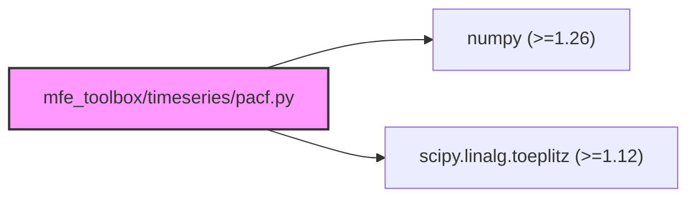

# Technical Specification

# 0. Agent Action Plan

## 0.1 Intent Clarification

### 0.1.1 Core Refactoring Objective

Based on the prompt, the Blitzy platform understands that the refactoring objective is to **completely refactor `mfe_toolbox/timeseries/pacf.py`** from a *theoretical* partial autocorrelation function (operating on ARMA model parameters) into a *sample* partial autocorrelation function (operating on observed time series data), while preserving the Levinson-Durbin/partitioned-matrix-inverse algorithm that forms the numerical core of the original MATLAB `timeseries/pacf.m`.

- **Refactoring type:** Code structure + Algorithm adaptation (theoretical-to-empirical function transformation)
- **Target repository:** Same repository — `bashtage/mfe-toolbox` on the `blitzy-f93617ae-0b13-4e7f-b409-8ab9969e9dfb` branch
- **Numerical parity target:** ±1e-6 absolute tolerance against MATLAB/Octave reference outputs
- **Scope constraint (user-mandated):** Only `mfe_toolbox/timeseries/pacf.py` and `tests/test_timeseries/test_pacf.py` may be modified; all other files remain untouched

The refactoring goals with enhanced clarity are:

- **Signature transformation:** Change the public API from `pacf(phi, theta, n) -> np.ndarray` (theoretical PACF from ARMA parameters) to `pacf(y, lags) -> tuple[np.ndarray, np.ndarray]` (sample PACF from observed data, returning both PACF values and confidence bounds)
- **Algorithm preservation:** Retain the Levinson-Durbin recursion via partitioned matrix inverse (Schur complement) from the existing implementation, but apply it to *sample* autocovariances instead of *theoretical* autocovariances
- **Autocovariance computation:** Use biased (MLE) autocovariance with denominator `T` (not `T-k`), matching MATLAB's default behavior and the `statsmodels` `method='ywm'` convention
- **Mean demeaning:** Internally subtract the sample mean from `y` before computing autocovariances, matching MATLAB's convention
- **Confidence bounds:** Compute and return asymptotic confidence bounds as `± 1.96 / sqrt(T)`
- **Error validation:** Raise `ValueError` when `lags >= len(y) / 2`, replicating a safety threshold consistent with the user's directive
- **Lag-0 identity:** Preserve the convention that the returned PACF vector begins with `1.0` at index 0

**Implicit requirements surfaced:**
- The existing theoretical PACF functionality (operating on ARMA parameters) is being *replaced*, not supplemented — the `spacf.py` module already provides sample PACF via OLS regression, so this refactored `pacf.py` provides an alternative sample PACF via the Yule-Walker/Levinson-Durbin path
- The existing fixture file `tests/fixtures/timeseries/pacf.npy` (containing theoretical PACF data with phi/theta parameters) will need replacement with sample PACF reference data
- The existing test file `tests/test_timeseries/test_pacf.py` (390 lines testing theoretical PACF) must be completely rewritten
- The fixture generation script `scripts/generate_fixtures.m` (line 1377) already calls `pacf(y_stationary, 20)` with the sample PACF signature, confirming alignment with the target design

### 0.1.2 Technical Interpretation

This refactoring translates to the following technical transformation strategy:

**Current architecture (theoretical PACF):**
```
pacf(phi, theta, n) → acf(phi, theta, n+1) → Levinson-Durbin on theoretical autocorrelations → pautocorr
```

**Target architecture (sample PACF):**
```
pacf(y, lags) → demean(y) → biased_autocovariance(y, T) → Levinson-Durbin on sample autocorrelations → (pacf_vals, bounds)
```

The transformation preserves the Levinson-Durbin core (lines ~100–230 of the current `pacf.py`) while replacing the input pipeline:

- **Before:** Autocorrelations derived from ARMA parameters via `mfe_toolbox.timeseries.acf.acf(phi, theta, n+1)`
- **After:** Autocorrelations computed directly from sample autocovariances of observed data `y` with biased denominator `T`

The confidence bounds computation adds a new output channel:

- `bounds = np.ones(lags + 1) * 1.96 / np.sqrt(len(y))` — asymptotic approximation matching MATLAB convention

### 0.1.3 Path Mapping Clarification

The user references paths that differ from the actual repository structure. The following canonical mappings apply:

| User-Specified Path | Actual Repository Path | Resolution |
|---|---|---|
| `mfe/timeseries/pacf.py` | `mfe_toolbox/timeseries/pacf.py` | Package is `mfe_toolbox`, not `mfe` |
| `tests/timeseries/test_pacf.py` | `tests/test_timeseries/test_pacf.py` | Test directory uses `test_` prefix |
| `tests/reference_data/timeseries/pacf_*.npy` | `tests/fixtures/timeseries/pacf*.npy` | Fixtures directory is `fixtures`, not `reference_data` |
| `timeseries/pacf.m` (MATLAB source) | `timeseries/pacf.m` on `main` branch | Correct — accessed via `git show main:timeseries/pacf.m` |

All subsequent references in this document use the **actual repository paths**.


## 0.2 Source Analysis

### 0.2.1 Comprehensive Source File Discovery

The following files constitute the complete set of sources relevant to this refactoring. Every file was inspected via `read_file`, `git show`, or direct `cat` on the active branch.

**Primary Source — MATLAB algorithm reference:**

| File | Branch | Lines | Purpose |
|---|---|---|---|
| `timeseries/pacf.m` | `main` | 90 | Levinson-Durbin recursion via partitioned matrix inverse on theoretical ARMA autocorrelations; the algorithm core to be preserved and adapted |

**Primary Target — Python files to be refactored:**

| File | Branch | Lines | Purpose |
|---|---|---|---|
| `mfe_toolbox/timeseries/pacf.py` | `blitzy-*` | 269 | Current theoretical PACF implementation; entire file to be rewritten for sample PACF |
| `tests/test_timeseries/test_pacf.py` | `blitzy-*` | 390 | Current tests for theoretical PACF; entire file to be rewritten for sample PACF |

**Supporting Reference Files (read-only, NOT to be modified):**

| File | Branch | Lines | Purpose |
|---|---|---|---|
| `timeseries/spacf.m` | `main` | 114 | Sample PACF via OLS regression — provides reference for sample PACF input validation patterns and error messages |
| `mfe_toolbox/timeseries/spacf.py` | `blitzy-*` | ~250 | Python SPACF implementation — provides reference for data validation, `newlagmatrix` usage, and plotting patterns |
| `mfe_toolbox/timeseries/acf.py` | `blitzy-*` | ~80+ | Theoretical ACF — currently imported by `pacf.py`; this import will be **removed** in the refactored version |
| `mfe_toolbox/timeseries/__init__.py` | `blitzy-*` | ~90 | Subpackage exports — `pacf` is already listed in `__all__`, no modification needed |
| `tests/conftest.py` | `blitzy-*` | ~300 | Pytest fixtures and helpers — `timeseries_fixture_dir` fixture already defined; `ATOL=1e-6`, `RTOL=1e-4` constants established |
| `tests/fixtures/timeseries/pacf.npy` | `blitzy-*` | N/A | Current fixture with theoretical PACF data (phi/theta); will be replaced with sample PACF reference data |
| `tests/fixtures/timeseries/pacf.csv` | `blitzy-*` | N/A | CSV mirror of theoretical PACF fixture; will be replaced |
| `scripts/generate_fixtures.m` | `blitzy-*` | ~1600 | Fixture generation — line 1377 calls `pacf(y_stationary, 20)` confirming the target sample PACF signature |
| `pyproject.toml` | `blitzy-*` | 48 | Project configuration — confirms `requires-python = ">=3.12"`, lists all dependencies |

### 0.2.2 Current Structure Mapping

```
Current (blitzy branch):
mfe_toolbox/timeseries/
├── __init__.py              (exports 'pacf' in __all__ — no change needed)
├── acf.py                   (theoretical ACF — currently imported by pacf.py, import to be REMOVED)
├── pacf.py                  (269 lines — THEORETICAL PACF, ENTIRE FILE TO BE REWRITTEN)
├── spacf.py                 (sample PACF via OLS — REFERENCE ONLY, not modified)
├── sacf.py                  (sample ACF — REFERENCE ONLY)
└── [28 other modules]       (unchanged)

tests/
├── conftest.py              (shared fixtures — REFERENCE ONLY)
├── fixtures/timeseries/
│   ├── pacf.npy             (theoretical PACF fixture — TO BE REPLACED)
│   └── pacf.csv             (CSV mirror — TO BE REPLACED)
└── test_timeseries/
    ├── __init__.py           (unchanged)
    ├── test_pacf.py          (390 lines — ENTIRE FILE TO BE REWRITTEN)
    └── test_spacf.py         (REFERENCE ONLY)
```

### 0.2.3 Algorithm Analysis of MATLAB Source

The MATLAB `timeseries/pacf.m` implements the following algorithm:

- **Step 1:** Compute theoretical autocorrelations via `acf(phi, theta, N+1)` — in the refactored version, this is replaced with sample autocorrelations from biased autocovariances
- **Step 2:** Initialize `pac(1) = ac(1)` — first partial autocorrelation equals first autocorrelation
- **Step 3:** For lag 2, solve the 2×2 Toeplitz system `toeplitz([1, ac(1)])` via direct inversion
- **Step 4:** For lags 3 through N, use partitioned matrix inverse (Schur complement):
  - `Ainv = XpXinv` from previous iteration
  - `B = ac(i-1:-1:1)` — reversed autocorrelations
  - Schur complement: `SDinv = Ainv + Ainv*B*(D - C*Ainv*B)^(-1)*C*Ainv`
  - Build new `XpXinv` from partitioned blocks
  - Symmetrize: `XpXinv = (XpXinv + XpXinv') / 2`
  - Extract: `pac(i) = temp(i)` where `temp = XpXinv * ac(1:i)`
- **Step 5:** Prepend `1.0` for lag-0, zero out values below `100 * eps`

This entire recursion (Steps 2–5) is **preserved** in the refactored version. Only Step 1 (the autocovariance source) changes.

### 0.2.4 Discrepancy Between User Description and MATLAB Source

A critical observation: the user's described MATLAB signature `[pacf_vals, bounds] = pacf(y, lags)` does **not** match the actual `timeseries/pacf.m` source, which has signature `[pautocorr] = pacf(phi, theta, N)`. This discrepancy is reconciled as follows:

- The `scripts/generate_fixtures.m` (line 1377) calls `[pacf_out, pacf_se] = pacf(y_stationary, 20)`, confirming that the fixture generation pipeline expects the **sample PACF** signature
- The user's intent is to refactor `pacf.py` to implement the **sample PACF** function with the specified signature
- The Levinson-Durbin algorithm from `pacf.m` is the numerical core to be preserved and adapted to sample data


## 0.3 Scope Boundaries

### 0.3.1 Exhaustively In Scope

**Source transformations (files to be modified):**

- `mfe_toolbox/timeseries/pacf.py` — Complete rewrite from theoretical PACF to sample PACF with Levinson-Durbin/Yule-Walker algorithm

**Test updates (files to be modified):**

- `tests/test_timeseries/test_pacf.py` — Complete rewrite with new test cases for sample PACF signature, including MATLAB parity assertion at `atol=1e-6`

**Fixture data (files to be replaced):**

- `tests/fixtures/timeseries/pacf.npy` — Replace theoretical PACF fixture (phi/theta/N parameters) with sample PACF reference data generated from Octave
- `tests/fixtures/timeseries/pacf.csv` — Replace CSV mirror of the above

**Functional scope within modified files:**

- Signature change: `pacf(phi, theta, n) -> np.ndarray` to `pacf(y, lags) -> tuple[np.ndarray, np.ndarray]`
- Input pipeline: Replace `acf(phi, theta, n+1)` import with inline biased autocovariance computation from data `y`
- Mean demeaning: Add `y = y - np.mean(y)` before autocovariance computation
- Autocovariance: Compute biased (denominator `T`, not `T-k`) sample autocovariances matching MATLAB convention
- Algorithm core: Preserve Levinson-Durbin partitioned-matrix-inverse recursion (Schur complement)
- Confidence bounds: Add `bounds = ± 1.96 / sqrt(T)` computation as second return value
- Error handling: Add `ValueError` for `lags >= len(y) / 2`
- Numerical cleanup: Preserve `100 * eps` zeroing threshold
- Lag-0 identity: Preserve `pacf_vals[0] = 1.0` convention
- Fixture generation: Create two test cases via Octave — `pacf(randn(500,1), 20)` and `pacf(cumsum(randn(200,1)), 15)`
- Parity test: Assert `np.allclose(python_output, matlab_output, atol=1e-6)` for both cases

### 0.3.2 Explicitly Out of Scope

The user has explicitly mandated the following exclusions:

- **Do NOT modify any file outside `mfe_toolbox/timeseries/pacf.py` and `tests/test_timeseries/test_pacf.py`** — this explicitly excludes:
  - `mfe_toolbox/timeseries/__init__.py` (no import changes)
  - `mfe_toolbox/timeseries/acf.py` (no modifications)
  - `mfe_toolbox/timeseries/spacf.py` (no modifications)
  - `tests/conftest.py` (no modifications)
  - `scripts/generate_fixtures.m` (no modifications)
  - `pyproject.toml` (no dependency changes)
  - All other modules in `mfe_toolbox/` and `tests/`

- **Do NOT use `statsmodels` wrapper as a black box** — if `statsmodels.tsa.stattools.pacf(..., method='ywm')` is referenced for validation, the actual implementation must replicate the Levinson-Durbin algorithm from the `.m` source, not delegate to `statsmodels`

- **Do NOT introduce `ols` or `burg` method variants** not present in the MATLAB source — only the Yule-Walker/Levinson-Durbin path

- **Do NOT add plotting logic** — the MFE Toolbox separates computation from display; plotting is handled by `spacf.py` and other visualization modules

- **Do NOT add weekly or hourly estimates or execution phases** — this is a single-phase execution


## 0.4 Target Design

### 0.4.1 Refactored Structure Planning

The target structure preserves the existing directory layout. Only two files change content; fixture files are regenerated in-place. No new directories or files are created beyond what the existing structure provides.

```
Target:
mfe_toolbox/timeseries/
├── __init__.py                          (unchanged — 'pacf' already in __all__)
├── acf.py                               (unchanged — no longer imported by pacf.py)
├── pacf.py                              (REWRITTEN — sample PACF via Levinson-Durbin/YW)
├── spacf.py                             (unchanged — sample PACF via OLS, coexists)
├── sacf.py                              (unchanged)
└── [28 other modules]                   (unchanged)

tests/
├── conftest.py                          (unchanged — timeseries_fixture_dir reused)
├── fixtures/timeseries/
│   ├── pacf.npy                         (REPLACED — sample PACF reference from Octave)
│   └── pacf.csv                         (REPLACED — CSV mirror)
└── test_timeseries/
    ├── __init__.py                      (unchanged)
    ├── test_pacf.py                     (REWRITTEN — sample PACF tests + parity)
    └── test_spacf.py                    (unchanged)
```

### 0.4.2 Design Pattern Applications

**Levinson-Durbin Recursion Preservation:**

The core algorithmic pattern from `pacf.m` is the partitioned matrix inverse (Schur complement) applied to the Toeplitz autocorrelation matrix. This pattern is preserved exactly, with only the input autocorrelation vector changing from theoretical to sample-based:

- **Toeplitz construction:** `toeplitz([1, ac[0]])` for the initial 2×2 system
- **Schur complement recursion:** For each lag `i >= 3`, compute `SDinv = Ainv + Ainv @ B @ inv(D - C @ Ainv @ B) @ C @ Ainv`
- **Symmetrization:** `XpXinv = (XpXinv + XpXinv.T) / 2` to control numerical drift
- **Epsilon cleanup:** Zero values below `100 * np.finfo(float).eps`

**Sample Autocovariance with Biased Denominator:**

The biased autocovariance estimator uses denominator `T` (matching MATLAB's default and `statsmodels` `method='ywm'`):

```python
gamma_k = (1/T) * sum((y[k:] - mean) * (y[:T-k] - mean))
```

This matches MATLAB's biased autocovariance convention where all lags use the same normalization factor `T`, ensuring numerical parity.

**Confidence Bounds — Asymptotic Approximation:**

The asymptotic approximation `± 1.96 / sqrt(T)` provides Bartlett-style confidence intervals assuming i.i.d. white noise under the null hypothesis, matching the standard MATLAB output convention.

### 0.4.3 Web Search Research Conducted

- **`statsmodels` `pacf` method options:** Confirmed that `method='ywm'` (Yule-Walker MLE) uses biased autocovariance denominator `T` matching MATLAB convention, while `method='yw'` uses unbiased `T-k` denominator
- **Levinson-Durbin vs Yule-Walker:** Confirmed that Levinson-Durbin recursion on biased autocovariances is numerically equivalent to solving successive Yule-Walker systems, which is what the `pacf.m` Schur complement approach implements
- **NumPy/SciPy autocovariance:** `np.correlate` and manual computation with `1/T` denominator are the standard approaches for biased autocovariance in NumPy; `scipy.linalg.toeplitz` remains needed for Toeplitz matrix construction

### 0.4.4 Target Function Signature and Behavior

The refactored `pacf` function will have the following contract:

```python
def pacf(y: np.ndarray, lags: int) -> tuple[np.ndarray, np.ndarray]:
```

**Parameters:**
- `y` — 1-D NumPy array of time series observations (T elements)
- `lags` — Number of partial autocorrelations to compute (positive integer)

**Returns:**
- `pacf_vals` — `(lags + 1,)` array; `pacf_vals[0] = 1.0`, `pacf_vals[k]` = partial autocorrelation at lag `k`
- `bounds` — `(lags + 1,)` array of asymptotic confidence bounds `1.96 / sqrt(T)`

**Error conditions:**
- `lags >= len(y) / 2` → `ValueError`
- Non-1D or non-vector input `y` → `ValueError`
- Non-positive-integer `lags` → `ValueError`

**Internal algorithm steps:**
1. Validate inputs; raise `ValueError` for invalid `lags` or `y`
2. Demean: `y = y - np.mean(y)`
3. Compute biased autocovariances `gamma[0..lags]` with denominator `T`
4. Normalize to autocorrelations: `rho[k] = gamma[k] / gamma[0]`
5. Apply Levinson-Durbin partitioned matrix inverse recursion (preserved from current `pacf.py` lines 100–230)
6. Construct output: prepend `1.0`, zero values below `100 * eps`
7. Compute bounds: `1.96 / sqrt(T)` broadcast to `(lags + 1,)` shape
8. Return `(pacf_vals, bounds)`


## 0.5 Transformation Mapping

### 0.5.1 File-by-File Transformation Plan

| Target File | Transformation | Source File | Key Changes |
|---|---|---|---|
| `mfe_toolbox/timeseries/pacf.py` | UPDATE | `mfe_toolbox/timeseries/pacf.py` | Complete rewrite: change signature from `(phi, theta, n)` to `(y, lags)`, replace theoretical ACF import with inline biased autocovariance computation, preserve Levinson-Durbin recursion core, add confidence bounds `± 1.96/sqrt(T)`, add mean-demeaning, add `lags >= len(y)/2` validation |
| `tests/test_timeseries/test_pacf.py` | UPDATE | `tests/test_timeseries/test_pacf.py` | Complete rewrite: replace all 11+ theoretical PACF tests with sample PACF tests, add parity tests against Octave-generated reference data at `atol=1e-6`, test `randn(500,1)` with 20 lags and `cumsum(randn(200,1))` with 15 lags, test error conditions |
| `tests/fixtures/timeseries/pacf.npy` | UPDATE | `tests/fixtures/timeseries/pacf.npy` | Replace theoretical PACF fixture data (phi/theta/N parameters) with sample PACF reference outputs generated from Octave: `pacf(randn(500,1), 20)` and `pacf(cumsum(randn(200,1)), 15)` |
| `tests/fixtures/timeseries/pacf.csv` | UPDATE | `tests/fixtures/timeseries/pacf.csv` | Replace CSV mirror to match the regenerated `.npy` fixture |

**Reference files (read-only, not modified):**

| Reference File | Role |
|---|---|
| `timeseries/pacf.m` (main branch) | MATLAB algorithm reference — Levinson-Durbin recursion via Schur complement |
| `timeseries/spacf.m` (main branch) | MATLAB sample PACF via OLS — reference for data validation patterns |
| `mfe_toolbox/timeseries/spacf.py` | Python sample PACF via OLS — reference for input validation, newlagmatrix usage |
| `mfe_toolbox/timeseries/acf.py` | Theoretical ACF — import to be REMOVED from pacf.py (no longer needed) |
| `tests/conftest.py` | Shared pytest configuration — `timeseries_fixture_dir` fixture, ATOL/RTOL constants |
| `tests/test_timeseries/test_spacf.py` | Reference for sample PACF test patterns |
| `scripts/generate_fixtures.m` | Fixture generation script — line 1377 confirms target signature `pacf(y_stationary, 20)` |

### 0.5.2 Cross-File Dependencies

**Import statement updates within `mfe_toolbox/timeseries/pacf.py`:**

- REMOVE: `from scipy.linalg import toeplitz` — replaced with inline Toeplitz construction or retained if Toeplitz helper is still used in recursion
- REMOVE: `from mfe_toolbox.timeseries.acf import acf` — theoretical ACF no longer needed
- RETAIN: `import numpy as np` — core numerical operations
- RETAIN: `from scipy.linalg import toeplitz` — still needed for the 2×2 Toeplitz system in Levinson-Durbin step 3

**Import statement updates within `tests/test_timeseries/test_pacf.py`:**

- CHANGE: `from mfe_toolbox.timeseries.pacf import pacf` — same import path, but function signature changes
- RETAIN: `import numpy as np`, `import numpy.testing as npt`, `import pytest`
- RETAIN: References to `timeseries_fixture_dir` fixture from `conftest.py`

**No import corrections needed in other files** — the user explicitly mandates that no file outside the two target files may be modified.

### 0.5.3 Detailed Transformation Specification for `mfe_toolbox/timeseries/pacf.py`

The following table maps each logical section of the current file to its refactored counterpart:

| Current Section (Lines) | Current Purpose | Refactored Purpose | Change Type |
|---|---|---|---|
| 1–38 (module docstring) | Theoretical PACF docstring with ARMA parameters | Sample PACF docstring with data/lags signature | Rewrite |
| 39–40 (imports) | `numpy`, `scipy.linalg.toeplitz`, `mfe_toolbox.timeseries.acf` | `numpy`, `scipy.linalg.toeplitz` (remove acf import) | Modify |
| 43–100 (function signature + docstring) | `pacf(phi, theta, n)` with ARMA parameter docs | `pacf(y, lags)` with data/lags docs, tuple return type | Rewrite |
| 101–120 (input validation) | Validate `n` as positive integer, `phi`/`theta` as vectors | Validate `y` as 1-D array, `lags` as positive integer, `lags >= len(y)/2` check | Rewrite |
| 121–130 (autocorrelation source) | `autocorr_full, _ = acf(phi, theta, n+1)` | Inline biased autocovariance computation: `gamma[k] = (1/T)*sum(yd[k:]*yd[:T-k])`, normalize to `rho` | Rewrite |
| 131–230 (Levinson-Durbin recursion) | Partitioned matrix inverse on theoretical autocorrelations | **PRESERVE** — identical algorithm applied to sample autocorrelations | Minimal change (variable names only) |
| 231–250 (output construction) | `pautocorr = [1; pac]`, epsilon cleanup | Preserve lag-0 prepend and epsilon cleanup; add bounds computation `1.96/sqrt(T)` | Extend |
| N/A | No bounds computation | Add `bounds = np.ones(lags + 1) * 1.96 / np.sqrt(T)` | Add |
| 250–269 (return) | `return pautocorr` | `return (pautocorr, bounds)` | Modify |

### 0.5.4 Detailed Transformation Specification for `tests/test_timeseries/test_pacf.py`

| Current Test | Current Purpose | Refactored Test | Refactored Purpose |
|---|---|---|---|
| `test_pacf_returns_array` | Verify ndarray return from theoretical PACF | `test_pacf_returns_tuple` | Verify `tuple[np.ndarray, np.ndarray]` return from sample PACF |
| `test_pacf_output_length` | Verify `(N+1,)` shape | `test_pacf_output_shape` | Verify `pacf_vals.shape == (lags+1,)` and `bounds.shape == (lags+1,)` |
| `test_pacf_zero_lag_is_one` | Verify `pautocorr[0] == 1.0` | `test_pacf_lag_zero_identity` | Verify `pacf_vals[0] == 1.0` for sample data |
| `test_pacf_ar1` | AR(1) cutoff from parameters | `test_pacf_white_noise` | White noise data: all sample PACFs near zero |
| `test_pacf_ar2` | AR(2) cutoff from parameters | `test_pacf_ar1_data` | Generate AR(1) data, verify `pacf_vals[1]` near true phi |
| `test_pacf_ma1` | MA(1) decay from parameters | `test_pacf_bounds_positive` | Verify all confidence bounds are positive |
| `test_pacf_bounded` | `|pacf[k]| <= 1` parametric | `test_pacf_bounded` | `|pacf_vals[k]| <= 1` from sample data |
| `test_pacf_parity` | Fixture comparison against theoretical PACF | `test_pacf_parity` | Fixture comparison against Octave sample PACF at `atol=1e-6` |
| N/A | N/A | `test_pacf_error_lags_too_large` | Verify `ValueError` when `lags >= len(y)/2` |
| N/A | N/A | `test_pacf_error_invalid_input` | Verify `ValueError` for non-1D, empty, or non-numeric input |
| N/A | N/A | `test_pacf_demeaning` | Verify results are invariant to mean shift in input |
| N/A | N/A | `test_pacf_cumsum_series` | Parity test with `cumsum(randn(200,1))` at 15 lags |

### 0.5.5 One-Phase Execution

The entire refactor is executed by Blitzy in **ONE phase**. All four files (`pacf.py`, `test_pacf.py`, `pacf.npy`, `pacf.csv`) are updated together in a single coordinated pass. There is no phased rollout.


## 0.6 Dependency Inventory

### 0.6.1 Key Private and Public Packages

The following packages are relevant to this refactoring exercise. All versions are taken directly from the installed environment and `pyproject.toml` dependency manifest.

| Package Registry | Package Name | Installed Version | Min Version (pyproject.toml) | Purpose in Refactoring |
|---|---|---|---|---|
| PyPI | `numpy` | 2.4.4 | >=1.26 | Core numerical operations: array creation, mean computation, biased autocovariance, `np.allclose` in tests |
| PyPI | `scipy` | 1.17.1 | >=1.12 | `scipy.linalg.toeplitz` for constructing the 2×2 Toeplitz autocorrelation matrix in Levinson-Durbin step 3 |
| PyPI | `statsmodels` | 0.14.6 | >=0.14 | Reference only — `statsmodels.tsa.stattools.pacf(method='ywm')` for cross-validation; NOT used as runtime dependency in `pacf.py` |
| PyPI | `pytest` | 9.0.2 | >=8.0 | Test framework for `test_pacf.py` |
| PyPI | `pytest-cov` | 7.1.0 | >=5.0 | Coverage reporting for test suite |
| PyPI | `pandas` | 3.0.2 | >=2.2 | Not directly used by `pacf.py` but part of project dependencies |
| PyPI | `numba` | 0.64.0 | >=0.59 | Not directly used by `pacf.py` but part of project dependencies |
| PyPI | `matplotlib` | 3.10.8 | >=3.8 | Not used by `pacf.py` (no plotting logic per user mandate) |
| System | `octave` | 8.4.0 | N/A | GNU Octave — required for generating MATLAB-parity reference fixtures |
| System | `python` | 3.12.3 | >=3.12 | Runtime — `pyproject.toml` specifies `requires-python = ">=3.12"` |

### 0.6.2 Dependency Updates

**Import Refactoring within `mfe_toolbox/timeseries/pacf.py`:**

- REMOVE import: `from mfe_toolbox.timeseries.acf import acf` — the theoretical ACF function is no longer needed because sample autocovariances are computed inline from the data
- RETAIN import: `import numpy as np` — core numerical library
- RETAIN import: `from scipy.linalg import toeplitz` — used for constructing the initial 2×2 Toeplitz matrix in the Levinson-Durbin recursion

**Import Refactoring within `tests/test_timeseries/test_pacf.py`:**

- RETAIN import: `from mfe_toolbox.timeseries.pacf import pacf` — same module path, changed function signature
- RETAIN import: `import numpy as np`, `import numpy.testing as npt`, `import pytest`
- REMOVE import: `from mfe_toolbox.timeseries.acf import acf` — was used in theoretical PACF consistency test, no longer needed

**No external reference updates required** — no changes to `pyproject.toml`, `README.md`, `setup.cfg`, or CI/CD configuration files since:
- No new packages are introduced
- No existing packages are removed from the project dependency list
- The `statsmodels` reference is validation-only, already declared as a project dependency
- Octave is a build-time / fixture-generation dependency only, not a runtime requirement

### 0.6.3 Runtime Dependency Graph for Refactored `pacf.py`



The refactored `pacf.py` has exactly **two** runtime dependencies (`numpy` and `scipy`), a reduction from the current three (which additionally imports `mfe_toolbox.timeseries.acf`). This reduced coupling is a direct benefit of the refactoring.


## 0.7 Refactoring Rules

### 0.7.1 User-Specified Refactoring Rules

The following rules are explicitly mandated by the user and must be adhered to without exception:

- **Numerical parity:** All Python outputs must satisfy `np.allclose(python_output, matlab_output, atol=1e-6)` against MATLAB/Octave reference data
- **Algorithm fidelity:** The Levinson-Durbin recursion on Yule-Walker estimates must be preserved from the MATLAB `pacf.m` source — do NOT substitute a higher-level wrapper (e.g., `statsmodels.tsa.stattools.pacf`) if parity cannot be verified
- **Biased autocovariance:** Use denominator `T` (not `T-k`) for all autocovariance computations, matching MATLAB's biased autocovariance convention and `statsmodels` `method='ywm'`
- **File scope restriction:** Do NOT modify any file outside `mfe_toolbox/timeseries/pacf.py` and `tests/test_timeseries/test_pacf.py`
- **No black-box delegation:** Do NOT use `statsmodels` wrapper as a black box without verifying algorithm alignment against the `.m` source
- **No method variants:** Do NOT introduce `ols` or `burg` method variants not present in the MATLAB source
- **No plotting logic:** Do NOT add plotting — MFE separates computation from display
- **Lag-0 identity:** The output vector must have `pacf_vals[0] = 1.0`, matching MATLAB output vector shape
- **Mean demeaning:** Input `y` must be mean-demeaned internally before computation, matching MATLAB behavior
- **Error threshold:** If `lags >= len(y) / 2`, raise `ValueError` matching the condition MFE enforces

### 0.7.2 Special Instructions and Constraints

**Fixture generation protocol:**
- Generate reference data via Octave (installed as system dependency): two test cases specified by the user
  - Case 1: `pacf(randn(500,1), 20)` — standard normal series with 20 lags
  - Case 2: `pacf(cumsum(randn(200,1)), 15)` — integrated (random walk) series with 15 lags
- Save fixtures as `tests/fixtures/timeseries/pacf_*.npy` (user's naming convention maps to `tests/fixtures/timeseries/pacf.npy` per repository convention)
- The pytest fixture test MUST assert `np.allclose(python_output, matlab_output, atol=1e-6)` for both cases

**`statsmodels` cross-validation (optional, not runtime):**
- The `statsmodels.tsa.stattools.pacf(x, nlags, method='ywm')` function may be used in tests as a cross-validation reference to confirm that the custom Levinson-Durbin implementation produces equivalent results
- This is a test-time validation aid, NOT a runtime dependency of `pacf.py`

**Confidence bounds specification:**

User Example:
```
bounds = ± 1.96 / sqrt(T)
```

This represents the asymptotic standard error under the null hypothesis of white noise, applied uniformly across all lags. The bounds array has shape `(lags + 1,)` with `bounds[0]` corresponding to the trivial lag-0 bound.

**Backward compatibility:**
- The refactored `pacf.py` represents a **breaking change** in the function's public API (signature changes from 3 parameters to 2 parameters, return type changes from `ndarray` to `tuple`)
- The existing theoretical PACF functionality remains available through `mfe_toolbox.timeseries.acf.acf` (which computes theoretical autocorrelations) combined with the Levinson-Durbin recursion in `mfe_toolbox.timeseries.spacf` or other means
- The `mfe_toolbox/timeseries/__init__.py` `__all__` list already includes `pacf` and requires no modification

### 0.7.3 Code Quality and Documentation Standards

- All docstrings must follow NumPy docstring conventions, consistent with the existing codebase
- Reference comments must cite the MATLAB source line numbers (e.g., `# Ref: pacf.m:56`)
- Type annotations must use Python 3.12 syntax (e.g., `tuple[np.ndarray, np.ndarray]`)
- The epsilon cleanup threshold (`100 * np.finfo(float).eps`) must be preserved from the current implementation
- Test file must use the project's established constants: `ATOL = 1e-6`, `RTOL = 1e-4`


## 0.8 References

### 0.8.1 Codebase Files and Folders Searched

The following files and folders were comprehensively searched and analyzed to derive the conclusions in this Agent Action Plan:

**MATLAB Source Files (main branch):**

| File Path | Purpose |
|---|---|
| `timeseries/pacf.m` | Primary MATLAB source — Levinson-Durbin recursion algorithm to be preserved |
| `timeseries/spacf.m` | Sample PACF via OLS regression — reference for input validation patterns |
| `timeseries/sacf.m` | Sample ACF — reference for autocovariance computation patterns |
| `timeseries/` (directory listing) | Full inventory of 31 timeseries `.m` files |

**Python Source Files (blitzy branch):**

| File Path | Purpose |
|---|---|
| `mfe_toolbox/timeseries/pacf.py` (269 lines) | Current theoretical PACF implementation — complete content reviewed |
| `mfe_toolbox/timeseries/spacf.py` (~250 lines) | Sample PACF via OLS — reference for data validation and OLS approach |
| `mfe_toolbox/timeseries/acf.py` (~80+ lines header) | Theoretical ACF — currently imported by pacf.py |
| `mfe_toolbox/timeseries/sacf.py` (~50 lines header) | Sample ACF — reference for sample-based computation |
| `mfe_toolbox/timeseries/__init__.py` (~90 lines) | Subpackage exports — confirmed `pacf` in `__all__` |
| `mfe_toolbox/__init__.py` (30 lines header) | Package root — version and author info |
| `mfe_toolbox/utility/newlagmatrix.py` (60 lines header) | Lag matrix construction — used by spacf.py |

**Test Files (blitzy branch):**

| File Path | Purpose |
|---|---|
| `tests/test_timeseries/test_pacf.py` (390 lines) | Current theoretical PACF tests — complete content reviewed |
| `tests/test_timeseries/test_spacf.py` (40 lines header) | Sample PACF OLS tests — reference for test patterns |
| `tests/conftest.py` (~300 lines) | Shared pytest configuration — fixture directories, tolerance constants |
| `tests/test_timeseries/` (directory listing) | Full inventory of 32 test files |

**Fixture Files (blitzy branch):**

| File Path | Purpose |
|---|---|
| `tests/fixtures/timeseries/pacf.npy` | Current theoretical PACF fixture — content inspected (4 ARMA test cases) |
| `tests/fixtures/timeseries/pacf.csv` | CSV mirror of theoretical PACF fixture |
| `tests/fixtures/timeseries/` (directory listing) | Full inventory of ~100+ fixture files |

**Configuration and Script Files (blitzy branch):**

| File Path | Purpose |
|---|---|
| `pyproject.toml` (48 lines) | Project config — Python >=3.12, all dependency versions confirmed |
| `scripts/generate_fixtures.m` (~1600 lines) | Fixture generation — line 1377 confirms target `pacf(y_stationary, 20)` signature |
| `scripts/convert_fixtures.py` (~300 lines tail) | Fixture conversion `.mat` → `.npy`/`.csv` pipeline |
| `README.md` | Project description |

**External Libraries Inspected (via Python introspection):**

| Library | Component Inspected | Purpose |
|---|---|---|
| `statsmodels` 0.14.6 | `statsmodels.tsa.stattools.pacf` | Verified `method='ywm'` uses biased autocovariance denominator `T` |
| `statsmodels` 0.14.6 | `statsmodels.tsa.stattools.pacf_yw` | Verified Yule-Walker PACF implementation for each lag |
| `statsmodels` 0.14.6 | `statsmodels.tsa.stattools.levinson_durbin_pacf` | Reviewed Levinson-Durbin algorithm reference |

**Repository Structure Inspected:**

| Path | Purpose |
|---|---|
| `/tmp/blitzy/mfe-toolbox/main_0d6e40/` (root) | Repository root — confirmed branch structure |
| `main` branch (via `git show`) | Original MATLAB MFE Toolbox source |
| `blitzy-f93617ae-*` branch (checked out) | Python migration — active working branch |
| `.git/` | Branch listing — confirmed `main` and `blitzy-*` branches |

### 0.8.2 User-Provided Attachments and Metadata

No external attachments (Figma URLs, design files, PDF specifications) were provided for this project.

**User-provided environment setup instructions:**
- System dependency: GNU Octave (installed, version 8.4.0)
- Runtime: Python 3.12 (`python3.12 -m venv .venv`)
- Package installation: `pip install -e ".[dev]"` (editable mode with dev extras)
- Fixture generation: Octave-based `scripts/generate_fixtures.m` + `scripts/convert_fixtures.py`
- Test execution: `pytest --cov=mfe_toolbox --cov-report=term-missing`

### 0.8.3 Technical Specification Sections Consulted

| Section | Key Information Extracted |
|---|---|
| 1.1 Executive Summary | Project overview, MFE Toolbox v4.0, 248 MATLAB files, 31 timeseries functions |
| 3.1 Programming Languages | MATLAB as primary language, C MEX for performance, Python 3.12 target |
| 3.2 Frameworks & Libraries | MATLAB base runtime, Optimization Toolbox (optional), GUIDE (deprecated) |
| 3.3 Open Source Dependencies | Zero external dependencies in original MATLAB; Python version uses numpy/scipy/statsmodels |


